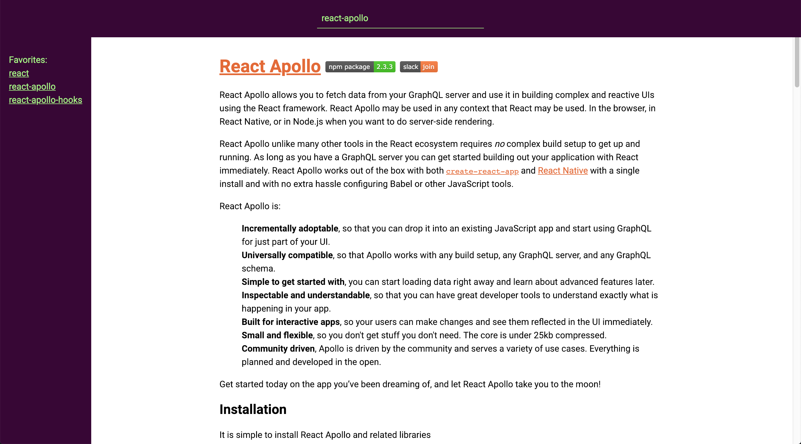

# Module Docs
an NPM package that creates a local server so you can browse README files of dependecies included in your applications `node_modules` directory


*Example screenshot*


## Installation

```bash
yarn add module-docs
```

## Setup

To add module-docs to your application, you can: 

Create an npm script in your applications `package.json` file that can run it.

```json
...
"scripts": {
  "start:docs": "module-docs start"
}
...
```

Or run it manually from the root directory of your application: 
```bash
npx run module-docs start
```

## Config

Create a `module-docs.config.js` file in the root of your application.

### Adding favorites

You can add favorites to the sidebar of the module-docs application like so:

```js
// module-docs.config.js
module.exports = {
  favorites: ["react", "react-apollo", "react-apollo-hooks"]
}

```

Which will result in the sidebar looking like this:

